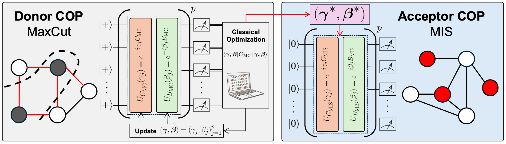
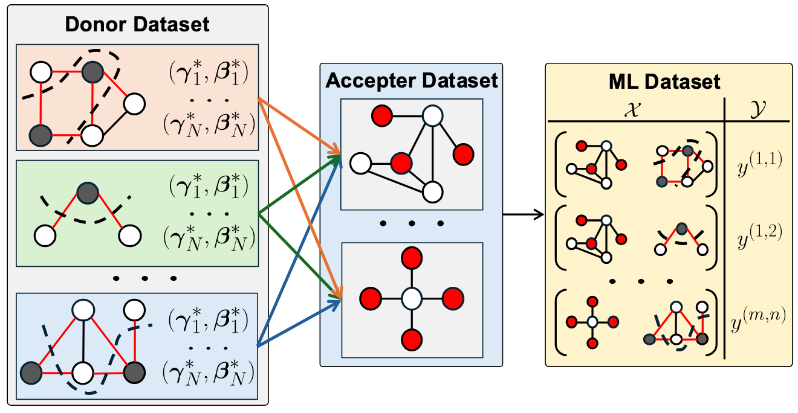
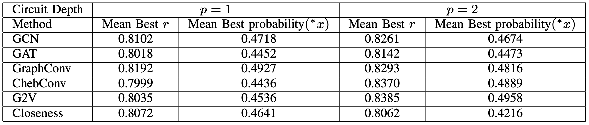

# [QCE'25] Cross-Problem Parameter Transfer in Quantum Approximate Optimization Algorithm: A Machine Learning Approach

**Authors:** Kien X. Nguyen, Bao Bach, Ilya Safro

The preprint version can be found at [https://arxiv.org/abs/2504.10733](https://arxiv.org/abs/2504.10733).

## Abstract :clipboard:
Quantum Approximate Optimization Algorithm (QAOA) is one of the most promising candidates to achieve the quantum advantage in solving combinatorial optimization problems.
The process of finding a good set of variational parameters in the QAOA circuit has proven to be challenging due to multiple factors, such as barren plateaus.
As a result, there is growing interest in exploiting *parameter transferability*, where parameter sets optimized for one problem instance are transferred to another that could be more complex either to estimate the solution or to serve as a warm start for further optimization. But can we transfer parameters from one class of problems to another? Leveraging parameter sets learned from a well-studied class of problems could help navigate the less studied one, reducing optimization overhead and mitigating performance pitfalls.
In this paper, we study whether pretrained QAOA parameters of MaxCut can be used as is or to warm start the Maximum Independent Set (MIS) circuits.
Specifically, we design machine learning models to find good donor candidates optimized on MaxCut and apply their parameters to MIS acceptors.
Our experimental results show that such parameter transfer can significantly reduce the number of optimization iterations required while achieving comparable approximation ratios.

<p align="center">

</p>

**Figure.** Overview of the parameter transfer procedure. First, QAOA is run on a quantum circuit to optimize for a *donor* COP (i.e. MaxCut) and retrieve the optimal parameter set $(\boldsymbol{\gamma}^*, \boldsymbol{\beta}^*)$. Next, those parameters are directly applied to the *acceptor* COP (i.e. MIS) without additional tuning.

## Data Generation
<p align="center">

</p>

**Figure.** During the data generation procedure, for each instance in the donor dataset $\mathcal{D}$, we train the QAOA circuit with $N$ random initializations $(\boldsymbol{\gamma}_1, \boldsymbol{\beta}_1) \dots (\boldsymbol{\gamma}_N, \boldsymbol{\beta}_N)$ on MaxCut. Then, we directly apply the $N$ optimized parameter sets $(\boldsymbol{\gamma}^*_1, \boldsymbol{\beta}^*_1) \dots (\boldsymbol{\gamma}^*_N, \boldsymbol{\beta}^*_N)$ to each MIS instance in the acceptor dataset $\mathcal{A}$ to retrieve the ground-truth transfer score, which is the average approximation ratios of the optimized MaxCut parameters on MIS.

**Dataset**

The dataset is in preparation and will be released soon...Stay tuned!

**Code for Data Generation**

The code base is in preparation and will be released soon...Stay tuned!

## Training

Here, we train a GNN-based model that predicts a transfer score given a pair of graphs. The GNN is used to produce the graph embedding and the FCN is used to predict the transfer score.

**Code for Training**

The code base is in preparation and will be released soon...Stay tuned!

## Testing

In this step, we use the trained neural network to retrieve the top-$k$ donors and evaluate their optimized MaxCut parameters on the MIS graphs via QAOA. We directly plug the optimized parameters and measure the quantum circuit for 1,000 shots. Then, the best set of parameters from each donors is selected.

We use two metrics to evaluate the transferability:
- Mean best approximation ratio: $r$
- Mean best probability of finding the ground state: $\text{probability}(^*x)$

"best" means best among the set of parameters of each donor.

**Code for Testing**

The code base is in preparation and will be released soon...Stay tuned!

**Results from Paper**
<p align="center">

</p>

## Reference :pencil2:
If you find this repository useful in your research, please use the following citation:
```
@inproceedings{nguyen2025crossproblemparametertransferquantum,
      title = {Cross-Problem Parameter Transfer in Quantum Approximate Optimization Algorithm: A Machine Learning Approach}, 
      author = {Kien X. Nguyen and Bao Bach and Ilya Safro},
      booktitle = {IEEE International Conference on Quantum Computing and Engineering}
      year = {2025}
}
```